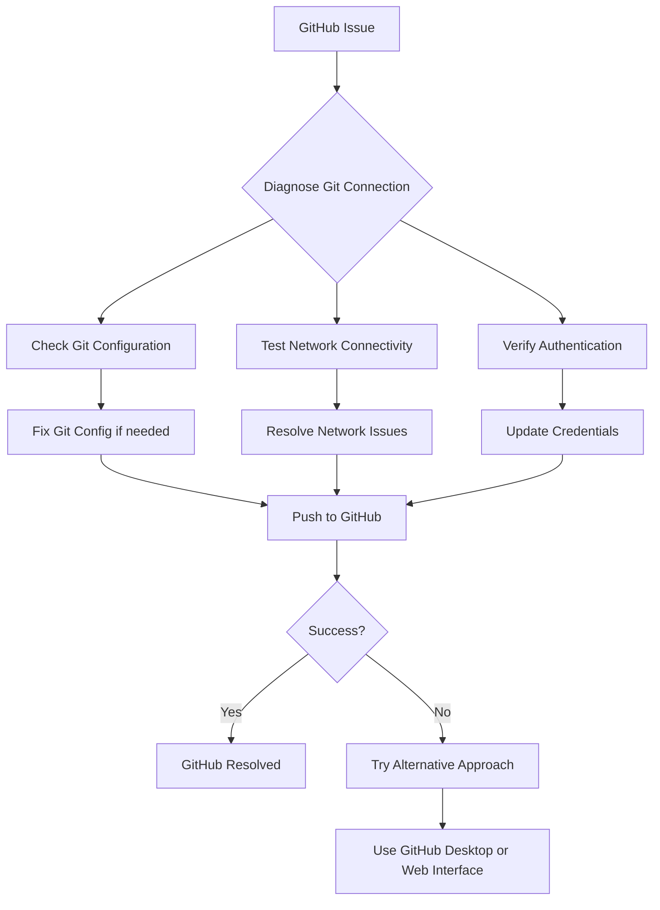
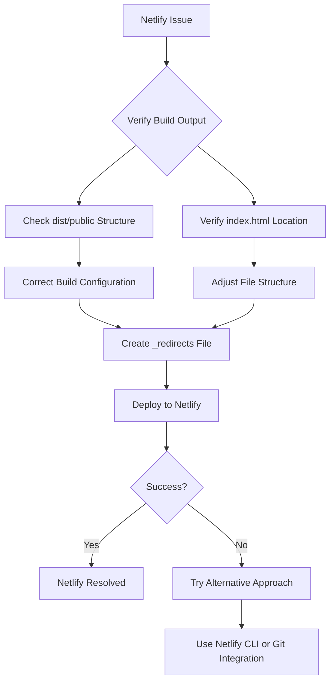

# GitHub and Netlify Deployment Plan

## 1. GitHub Issue Analysis

The fact that Git commands like `git status` and `git push` are not responding suggests several possible issues:

- **Network connectivity problems**: GitHub might be unreachable from your network
- **Git authentication issues**: Your credentials might not be properly configured
- **Git process hanging**: There might be a problem with your Git configuration or repository state
- **Firewall or proxy issues**: Network security settings might be blocking Git operations

## 2. Netlify Issue Analysis

Getting a 404 error when accessing your site on Netlify after uploading the `dist/public` folder suggests:

- **Incorrect publish directory**: Netlify might not be recognizing your uploaded files as the site root
- **Missing index.html**: The main entry point might not be at the root of your uploaded folder
- **Routing configuration issues**: The Netlify configuration might not be properly handling your routes
- **Build output structure mismatch**: The structure of your build output might not match what Netlify expects

## 3. Detailed Action Plan

### For GitHub Issues:



1. **Diagnose Git Connection**:

   - Run `git remote -v` to verify the remote URL is correct
   - Try `git fetch --verbose` to see detailed connection information
   - Check if GitHub.com is accessible in your browser

2. **Reset Git State**:

   - Try `git reset --hard HEAD` to reset any uncommitted changes
   - Run `git gc` to clean up the repository

3. **Authentication Setup**:

   - Verify your Git credentials are properly configured
   - Try setting up a personal access token for authentication
   - Configure Git to use the correct credentials helper

4. **Alternative Push Methods**:
   - If direct Git commands continue to fail, consider using GitHub Desktop
   - Or use the GitHub web interface to upload files directly

### For Netlify Issues:



1. **Verify Build Output**:

   - Examine the contents of your `dist/public` folder
   - Ensure `index.html` is at the root of this folder
   - Check that all assets (JS, CSS, images) are properly included

2. **Create Netlify Configuration Files**:

   - Add a `_redirects` file in your build output to handle routing
   - Simplify your `netlify.toml` configuration

3. **Alternative Deployment Methods**:

   - Try using the Netlify CLI for deployment instead of manual upload
   - Consider setting up continuous deployment from GitHub (once GitHub issues are resolved)

4. **Adjust Build Configuration**:
   - Modify your build script to ensure the correct output structure
   - Verify the publish directory matches what Netlify expects

## 4. Implementation Steps

### GitHub Resolution:

1. First, test basic Git functionality:

   ```bash
   git --version
   git status --porcelain
   ```

2. Check remote configuration:

   ```bash
   git remote -v
   git remote show origin
   ```

3. Test network connectivity:

   ```bash
   ping github.com
   curl -I https://github.com
   ```

4. Reset Git credentials:

   ```bash
   git config --global credential.helper
   git config --global user.name "Your Name"
   git config --global user.email "your.email@example.com"
   ```

5. Try a different protocol:
   ```bash
   git remote set-url origin https://github.com/blkboxlogictc/blkboxlogic_website.git
   ```

### Netlify Resolution:

1. Verify build output structure:

   ```bash
   ls -la dist/public
   ```

2. Create a `_redirects` file in your build output:

   ```
   /*    /index.html   200
   ```

3. Simplify your Netlify configuration:

   - Create a simplified `netlify.toml` in your project root
   - Ensure the publish directory is correctly specified

4. Try the Netlify CLI for deployment:

   ```bash
   npm install -g netlify-cli
   netlify login
   netlify deploy --prod
   ```

5. Check for common issues:
   - Ensure all paths in your React app are relative
   - Verify that client-side routing works correctly
   - Check for any hardcoded API URLs that might be causing issues
